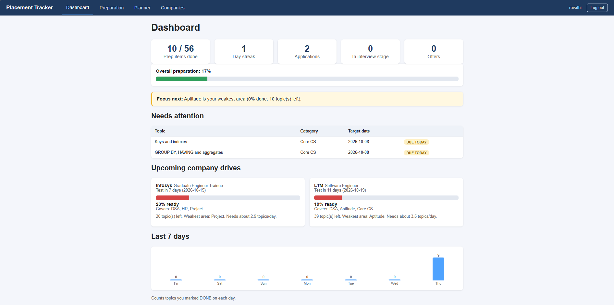
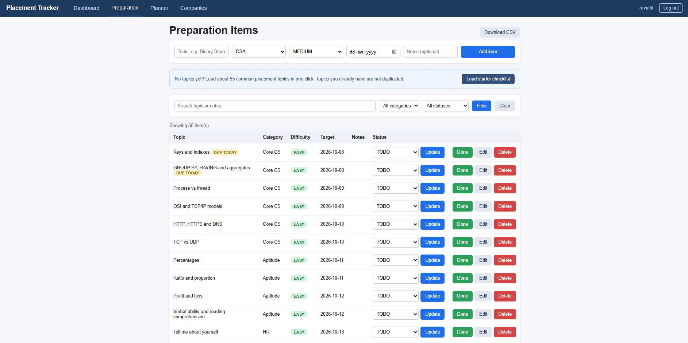
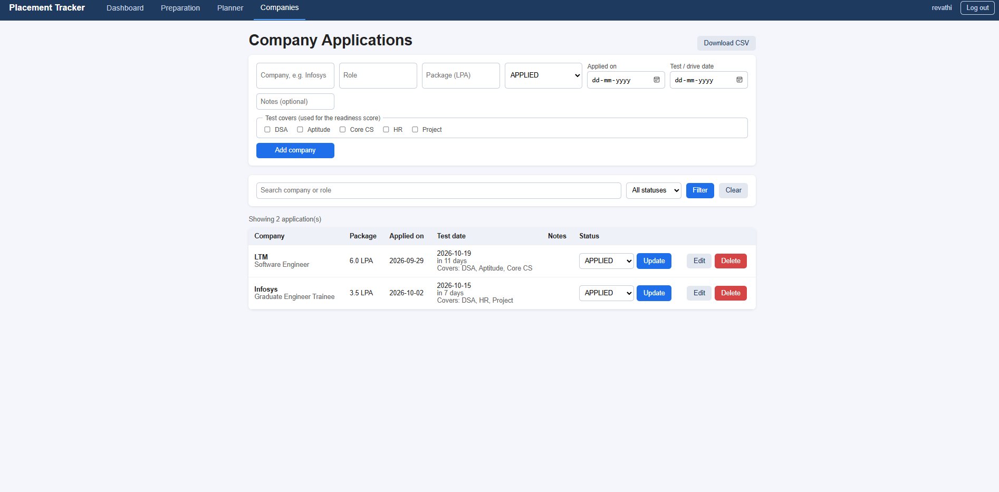
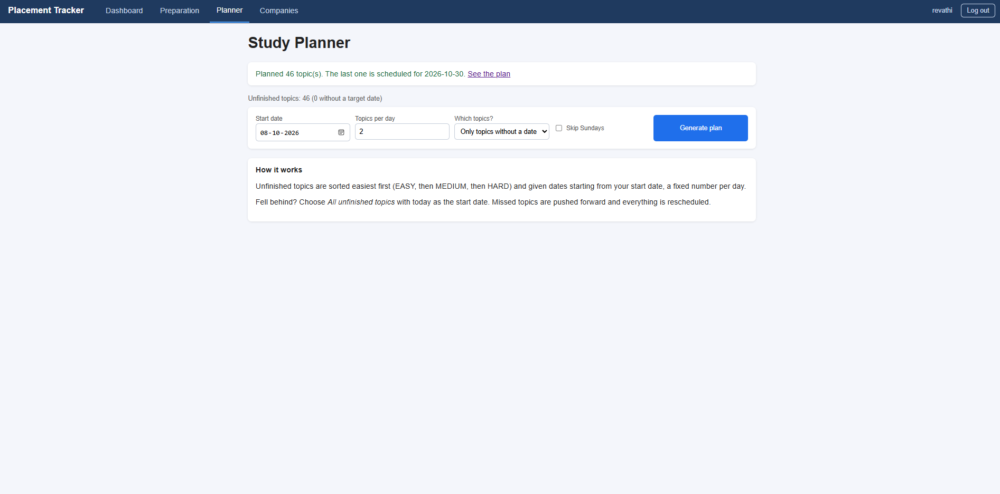

# Placement Preparation Tracker

A full-stack web app that helps students plan their placement preparation and keep track of company applications.
Built **from scratch with no frameworks**: Core Java, JDBC with SQLite, the JDK's built-in `HttpServer`, plain HTML and CSS.

> **Live demo:** _add your link here if you deploy it_

## Screenshots

| Dashboard | Preparation |
|---|---|
|  |  |

| Companies | Planner |
|---|---|
|  |  |

## The problem it solves

During placement season, preparation topics live in notebooks and company applications live in chats.
It is hard to answer simple questions: *What should I study today? Am I ready for the Infosys test next week? Which area am I weakest in?*
This app keeps both in one place and answers those questions.

## Features

**Preparation**
- Starter checklist of about 55 common placement topics (DSA, core CS, aptitude, HR, project) in one click
- Add, edit, delete, search and filter topics; one-click "Done"
- **Auto-planner:** gives every unfinished topic a target date (easiest first, N per day, optional Sundays off) and can re-plan missed topics
- Overdue and due-today highlighting

**Applications**
- Track each company through Applied, Test, Interview, Offer, Rejected, with package, dates and notes
- Record the test date and which topics the test covers

**Dashboard**
- **Readiness score per upcoming company test:** percent of that test's topics finished, days left, weakest area, and the topics per day needed
- Study streak and a last-7-days activity chart
- "Focus next" insight for the weakest category
- Progress by category, applications by status, and a "Needs attention" list

**Accounts and data**
- Register and log in; every user sees only their own data
- Download topics and applications as CSV (opens in Excel)

## Tech stack

| Layer | Technology |
|---|---|
| Server | Java 17, `com.sun.net.httpserver.HttpServer` |
| Database | SQLite through plain JDBC (`PreparedStatement` everywhere) |
| Front end | HTML and CSS generated on the server (no JavaScript) |
| Security | PBKDF2 password hashing, cookie sessions, per-user data scoping |
| Build | `javac`, no Maven or Gradle |

## How a request flows

```
Browser -> HttpServer -> SecureHandler (checks login cookie)
        -> PageHandler (Prep / Company / Planner / Home)
        -> DAO (SQL with PreparedStatement, always filtered by user_id)
        -> SQLite file
        <- HTML page (built with StringBuilder) <- Browser
```

Forms use POST followed by a redirect (post/redirect/get), so refreshing a page never resubmits a form.

## Project structure

```
src/
  Main.java                  starts the server and registers routes
  Database.java              connection, tables, small automatic migrations
  AuthHandler.java           login, register, logout
  SecureHandler.java         login check wrapped around each page
  Auth.java, UserDao.java    sessions and users
  PasswordUtil.java          PBKDF2 hashing, tokens
  PrepHandler.java           preparation page (CRUD, filters, search)
  CompanyHandler.java        company page
  PlannerHandler.java        auto-planner page
  HomeHandler.java           dashboard
  ExportHandler.java         CSV downloads
  PrepItemDao.java, CompanyDao.java   all SQL
  Insights.java              planner, streak, readiness logic (pure functions, no database)
  InsightsTest.java, SecurityTest.java   self-checks (run their main methods)
static/style.css
Dockerfile
```

## Run it locally

You need **JDK 17 or newer**.

1. Download two jars into a `lib/` folder:
   - `sqlite-jdbc-3.45.1.0.jar` from `https://repo1.maven.org/maven2/org/xerial/sqlite-jdbc/3.45.1.0/`
   - `slf4j-api-1.7.36.jar` from `https://repo1.maven.org/maven2/org/slf4j/slf4j-api/1.7.36/`
2. Compile and run from the project root.

   Windows:
   ```
   javac -cp "lib/*" -d out src/*.java
   java -cp "out;lib/*" Main
   ```
   Mac or Linux:
   ```
   javac -cp "lib/*" -d out src/*.java
   java -cp "out:lib/*" Main
   ```
3. Open http://localhost:8080 and create an account.

In IntelliJ: add both jars under *Project Structure > Modules > Dependencies*, then run `Main`.
Run the project from its root folder so `static/style.css` and `data/` are found.

Optional environment variables: `PORT` (default 8080), `DB_PATH` (default `data/tracker.db`), `COOKIE_SECURE=true` (set when served over https).

## Self-checks

Run the `main` method of `InsightsTest` (planner, streak, readiness logic) and `SecurityTest` (hashing and tokens). Each prints PASS or FAIL lines.

## Security notes

- Passwords are salted and hashed with PBKDF2-HMAC-SHA256 (120,000 iterations) and compared in constant time
- Session tokens are random 256-bit values; only their SHA-256 hash is stored; cookies are `HttpOnly` and `SameSite=Lax`
- All SQL uses `PreparedStatement`, so user input cannot change a query
- Every read and write is filtered by `user_id`, including updates and deletes by id, so one user cannot touch another's rows
- All user text is HTML-escaped before display
- Repeated wrong passwords temporarily lock a username
- CSV export neutralises values that start with `=`, `+`, `-` or `@`

## Deploy

The `Dockerfile` builds the app and downloads the jars, so it runs on any host that accepts Docker.
1. Push this project to GitHub.
2. Create a web service on a Docker-capable host and point it at the repository. Set `PORT` if the host asks for it.
3. **SQLite is a file.** Free plans usually erase files when the app restarts, so attach a persistent disk and set `DB_PATH` to a path on it (for example `/data/tracker.db`), otherwise accounts and data will be lost on restart.
4. Free plans may also put the app to sleep when idle, so the first visit can take a while.

## Known limitations and ideas

- Runs as a single server process on one SQLite file, which suits personal or small-group use, not heavy traffic
- No password reset or email; no reminders or notifications
- Pages are rendered on the server; a JSON API and a JavaScript front end would be the next step
- No account deletion page yet
